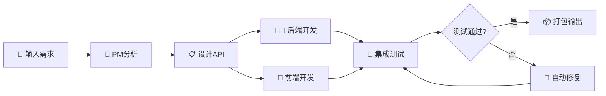

<div align="center">

# 🤖 DevSwarm

### 基于AI的多Agent协作Web应用开发平台

[](https://opensource.org/licenses/MIT)
[](https://www.python.org/downloads/)
[](CONTRIBUTING.md)

**从自然语言需求到完整Web应用，只需几分钟** ⚡

[快速开始](#-快速开始) • [在线演示](#-在线演示) • [文档](#-文档) • [贡献指南](CONTRIBUTING.md)

---

</div>

## 📖 项目简介

DevSwarm是一个革命性的**多Agent协作系统**，利用大型语言模型(LLM)的强大能力，实现从需求到代码的全自动化开发流程。

### 💡 核心理念

> "让AI团队为你工作，像真实的软件团队一样协作开发"

DevSwarm模拟了一个完整的软件开发团队：
- 📋 **项目经理** - 分析需求、制定计划、协调资源
- 💻 **后端工程师** - 设计和实现API服务
- 🎨 **前端工程师** - 创建用户界面
- 🧪 **测试工程师** - 质量保证和自动化测试

## ✨ 核心特性

<table>
<tr>
<td width="50%">

### 🎯 智能需求理解
- 自然语言输入
- 自动需求分析
- API契约自动生成
- 智能任务分解

</td>
<td width="50%">

### 🤝 多Agent协作
- 4个专业化Agent
- 异步消息通信
- 并行任务执行
- 实时状态同步

</td>
</tr>
<tr>
<td width="50%">

### 🔄 全自动流程
- 需求 → 设计 → 开发 → 测试
- 零人工干预
- 端到端自动化
- 完整项目输出

</td>
<td width="50%">

### 🐛 自愈能力
- 自动Bug检测
- 智能根因分析
- 自动代码修复
- 回归测试验证

</td>
</tr>
</table>

## 🎬 工作流程演示



## 🏗️ 系统架构

### 分层架构设计

```
┌─────────────────────────────────────────────────────────────┐
│                     👥 用户交互层                            │
│  ┌──────────────┐              ┌──────────────┐            │
│  │  Web UI      │              │  CLI Demo    │            │
│  │  (Flask)     │              │  (Python)    │            │
│  └──────┬───────┘              └──────┬───────┘            │
└─────────┼────────────────────────────┼────────────────────┘
          │                            │
          ▼                            ▼
┌─────────────────────────────────────────────────────────────┐
│                   🎯 编排协调层                              │
│                                                               │
│              ┌───────────────────────┐                      │
│              │   PM Agent (Orchestrator)                     │
│              │  • 需求分析  • 任务分配                       │
│              │  • 进度监控  • Bug协调                        │
│              └────────┬──────────────┘                      │
│                       │                                      │
│         ┌─────────────┼─────────────┐                      │
└─────────┼─────────────┼─────────────┼──────────────────────┘
          │             │             │
          ▼             ▼             ▼
┌─────────────────────────────────────────────────────────────┐
│                  👷 工作执行层                                │
│                                                               │
│  ┌────────────┐  ┌────────────┐  ┌────────────┐           │
│  │ Backend    │  │ Frontend   │  │    QA      │           │
│  │  Agent     │  │  Agent     │  │  Agent     │           │
│  │            │  │            │  │            │           │
│  │ Flask/API  │  │ HTML/CSS/JS│  │ Testing    │           │
│  └────────────┘  └────────────┘  └────────────┘           │
└─────────────────────────────────────────────────────────────┘
          │             │             │
          └─────────────┴─────────────┘
                       │
                       ▼
┌─────────────────────────────────────────────────────────────┐
│                 ⚙️ 基础设施层                                 │
│                                                               │
│  ┌──────────────┐  ┌──────────────┐  ┌──────────────┐     │
│  │ Message Bus  │  │ Shared State │  │  LLM Client  │     │
│  │  (Async)     │  │  (JSON)      │  │  (GPT-4)     │     │
│  └──────────────┘  └──────────────┘  └──────────────┘     │
└─────────────────────────────────────────────────────────────┘
```

### Agent职责分工

| Agent | 角色 | 核心技能 | 主要任务 |
|-------|------|----------|----------|
| **🎯 PM Agent** | 项目经理<br/>编排器 | 需求分析<br/>项目管理 | • 解析用户需求<br/>• 设计API契约<br/>• 分解和分配任务<br/>• 监控项目进度<br/>• 协调Bug修复 |
| **💻 Backend Agent** | 后端工程师 | Flask<br/>Python<br/>REST API | • 生成Flask代码<br/>• 实现API端点<br/>• 数据存储设计<br/>• 应用代码修复 |
| **🎨 Frontend Agent** | 前端工程师 | HTML/CSS<br/>JavaScript<br/>UI设计 | • 生成前端页面<br/>• 实现用户交互<br/>• API调用集成<br/>• 响应式设计 |
| **🧪 QA Agent** | 测试工程师 | 集成测试<br/>Bug检测 | • 启动测试服务<br/>• 执行API测试<br/>• 检测Bug并报告<br/>• 验证修复结果 |

## 🚀 快速开始

### 📋 环境要求

- **Python**: 3.9 或更高版本
- **API密钥**: OpenAI API Key 或 Anthropic API Key
- **内存**: 至少 2GB 可用内存
- **磁盘**: 至少 1GB 可用空间

### 🔧 安装步骤

1️⃣ **克隆仓库**

```bash
git clone https://github.com/yourusername/DevSwarm.git
cd DevSwarm
```

2️⃣ **创建虚拟环境**

```bash
# Linux/macOS
python -m venv venv
source venv/bin/activate

# Windows
python -m venv venv
venv\Scripts\activate
```

3️⃣ **安装依赖**

```bash
pip install -r requirements.txt
```

4️⃣ **配置API密钥**

```bash
# 复制环境变量模板
cp .env.example .env

# 编辑 .env 文件，添加你的API密钥
# OPENAI_API_KEY=sk-your-key-here
```

5️⃣ **启动系统**

```bash
# 方式1: 使用启动脚本（推荐）
./start.sh

# 方式2: 直接启动
python src/web/app.py

# 方式3: 命令行Demo
python demo.py
```

6️⃣ **访问Web界面**

打开浏览器访问: **http://localhost:3000**

## 💻 使用示例

### 示例1: 待办事项应用

```
输入需求:
我想要一个待办事项清单应用，支持：
- 添加新的待办事项
- 查看所有待办事项
- 删除已完成的事项
```

**系统将自动生成:**
- ✅ Flask后端API (3个端点)
- ✅ 响应式前端界面
- ✅ 完整的集成测试
- ✅ Docker配置文件
- ✅ 使用文档

⏱️ **预计时间**: 2-3分钟

### 示例2: 图书管理系统

```
输入需求:
创建一个图书管理系统，功能包括：
1. 添加新书（书名、作者、ISBN）
2. 查看所有图书列表
3. 按书名搜索图书
4. 更新图书信息
5. 删除图书记录
```

⏱️ **预计时间**: 5-8分钟

### 更多示例

<details>
<summary>📝 笔记应用</summary>

```
创建一个简单的笔记应用，可以：
- 创建新笔记（标题和内容）
- 查看所有笔记
- 编辑现有笔记
- 删除笔记
```
</details>

<details>
<summary>📇 联系人管理</summary>

```
我需要一个联系人管理系统：
- 添加联系人（姓名、电话、邮箱）
- 查看联系人列表
- 搜索联系人
- 更新联系人信息
- 删除联系人
```
</details>

<details>
<summary>💰 个人财务追踪</summary>

```
构建一个个人财务追踪应用：
- 记录收入和支出
- 按类别分类
- 查看交易历史
- 显示统计摘要
```
</details>

## 📁 生成的项目结构

系统会自动生成完整的项目结构：

```
workspace/proj_abc123/
├── 📄 README.md                    # 项目说明文档
├── 📋 api_contract.json            # API规范定义
├── 🐳 docker-compose.yml           # Docker编排配置
│
├── 💻 backend/                     # 后端目录
│   ├── app.py                      # Flask应用主文件
│   ├── storage.py                  # 数据存储模块
│   ├── requirements.txt            # Python依赖
│   ├── Dockerfile                  # 后端容器配置
│   ├── start.sh                    # 启动脚本
│   └── README.md                   # 后端文档
│
├── 🎨 frontend/                    # 前端目录
│   ├── index.html                  # 主页面
│   ├── app.js                      # 应用逻辑
│   ├── style.css                   # 样式文件
│   ├── package.json                # 前端配置
│   ├── Dockerfile                  # 前端容器配置
│   ├── start.sh                    # 启动脚本
│   └── README.md                   # 前端文档
│
└── 🧪 tests/                       # 测试目录
    └── integration_tests.py        # 集成测试
```

### 🚀 运行生成的应用

```bash
cd workspace/proj_abc123

# 方式1: 使用Docker Compose（推荐）
docker-compose up

# 方式2: 手动启动
# 终端1 - 启动后端
cd backend
pip install -r requirements.txt
python app.py

# 终端2 - 启动前端
cd frontend
python -m http.server 8000
```

访问应用:
- 前端: http://localhost:8000
- 后端API: http://localhost:5000

## 🎯 核心特性详解

### 1. API契约驱动开发

系统首先生成统一的API契约，确保前后端完美对齐：

```json
{
  "base_url": "http://localhost:5000",
  "version": "1.0",
  "endpoints": [
    {
      "method": "GET",
      "path": "/api/items",
      "description": "获取所有项目",
      "response": {
        "items": [
          {"id": "string", "title": "string", "completed": "boolean"}
        ]
      }
    },
    {
      "method": "POST",
      "path": "/api/items",
      "description": "创建新项目",
      "request_body": {
        "title": "string"
      },
      "response": {
        "id": "string",
        "title": "string",
        "completed": false
      }
    }
  ]
}
```

### 2. 智能代码自愈

当QA Agent检测到Bug时，系统会自动：

1. **分析根因** - 使用LLM分析错误日志和代码上下文
2. **生成修复** - 创建针对性的代码补丁
3. **应用修复** - 自动更新相关代码文件
4. **验证修复** - 重新运行测试确认问题已解决

```
🐛 Bug检测 → 🧠 智能分析 → 🔧 自动修复 → ✅ 验证通过
```

### 3. 实时进度监控

Web界面提供实时的项目状态监控：

- **项目状态**: initializing → planning → developing → testing → completed
- **任务进度**: 显示每个任务的状态（pending/in_progress/completed/failed）
- **Agent状态**: 查看每个Agent的当前工作
- **消息历史**: 追踪Agent间的所有通信

## 🚀 高级特性

### 1. 实时日志流 (WebSocket)

通过WebSocket实现实时日志推送，无需刷新即可查看系统运行状态：

- **实时更新**: 所有Agent活动立即显示
- **颜色编码**: 不同级别日志使用不同颜色 (DEBUG, INFO, WARNING, ERROR)
- **自动滚动**: 可切换自动滚动到最新日志
- **日志过滤**: 按Agent名称、级别过滤
- **性能优化**: 限制最大日志条目数防止内存溢出

```javascript
// 前端自动连接WebSocket日志流
const socket = io('/logs');
socket.on('log', (logData) => {
    console.log(`[${logData.logger}] ${logData.message}`);
});
```

### 2. 代码预览与浏览

在Web界面直接预览和浏览生成的代码，无需下载：

- **文件树导航**: 可视化项目文件结构
- **语法高亮**: 支持15+编程语言 (Python, JavaScript, Go, etc.)
- **一键复制**: 复制代码到剪贴板
- **文件类型图标**: 直观识别文件类型
- **实时更新**: 文件生成后自动刷新

**API端点**:
- `GET /api/files` - 获取项目文件树
- `GET /api/files/content?file_path=backend/app.py` - 获取文件内容

### 3. 性能监控与基准测试

全面的性能监控系统，追踪系统运行效率：

- **自动性能收集**: 装饰器自动记录函数执行时间
- **内存监控**: 追踪内存使用和增量
- **统计分析**: 平均值、最小值、最大值、成功率
- **基准测试**: 标准化测试场景
- **导出报告**: JSON格式性能报告

**使用示例**:
```python
from src.utils.performance import performance_monitor

@performance_monitor("my_task")
async def my_task():
    # 自动记录执行时间和资源使用
    pass

# 获取性能摘要
from src.utils.performance import PerformanceMetrics
summary = PerformanceMetrics.get_summary()
```

**API端点**:
- `GET /api/performance` - 获取性能指标摘要
- `POST /api/performance/export` - 导出性能报告
- `POST /api/benchmark/run` - 运行基准测试

### 4. 安全扫描

自动检测生成代码中的常见安全漏洞：

**支持检测的漏洞类型**:
- ✅ SQL注入 (SQL Injection)
- ✅ XSS跨站脚本 (Cross-Site Scripting)
- ✅ 硬编码密钥 (Hardcoded Secrets)
- ✅ 不安全随机数 (Insecure Random)
- ✅ 危险函数 (eval, exec)
- ✅ 路径遍历 (Path Traversal)
- ✅ 弱加密 (MD5, SHA1)
- ✅ 命令注入 (Command Injection)

**扫描报告**:
```json
{
  "total_vulnerabilities": 3,
  "vulnerabilities_by_severity": {
    "critical": 1,
    "high": 2,
    "medium": 0,
    "low": 0
  },
  "vulnerabilities": [
    {
      "type": "hardcoded_secret",
      "severity": "critical",
      "file_path": "backend/config.py",
      "line_number": 15,
      "description": "Hardcoded API key detected",
      "recommendation": "Use environment variables"
    }
  ]
}
```

**API端点**:
- `POST /api/security/scan` - 扫描整个项目
- `POST /api/security/scan/file` - 扫描单个文件

### 5. 多语言后端支持

支持生成多种后端语言和框架，满足不同技术栈需求：

#### 支持的后端技术栈:

**🐍 Python + Flask** (默认)
```bash
export DEVSWARM_BACKEND_LANGUAGE=flask
```
- Flask web框架
- CORS支持
- JSON数据存储
- requirements.txt

**🟢 Node.js + Express**
```bash
export DEVSWARM_BACKEND_LANGUAGE=nodejs
```
- Express.js框架
- 异步/await支持
- npm包管理
- nodemon热重载

**🐹 Go + Gin**
```bash
export DEVSWARM_BACKEND_LANGUAGE=go
```
- 高性能Gin框架
- 并发处理
- Go modules
- 编译型语言优势

#### 所有后端实现相同的API:
```
GET    /api/items      - 获取所有项目
POST   /api/items      - 创建新项目
PUT    /api/items/:id  - 更新项目
DELETE /api/items/:id  - 删除项目
GET    /health         - 健康检查
```

#### 生成的项目结构对比:

**Flask**:
```
backend/
├── app.py              # Flask应用
├── storage.py          # 数据存储
├── requirements.txt    # Python依赖
└── README.md
```

**Node.js/Express**:
```
backend/
├── server.js           # Express服务器
├── package.json        # npm依赖
├── .env.example        # 环境变量模板
└── README.md
```

**Go/Gin**:
```
backend/
├── main.go             # Go主文件
├── go.mod              # Go模块定义
├── .env.example        # 环境变量模板
└── README.md
```

### 配置系统

统一的配置管理系统，支持环境变量配置：

```bash
# 设置后端语言
export DEVSWARM_BACKEND_LANGUAGE=nodejs  # flask, nodejs, go

# 设置前端框架 (未来支持)
export DEVSWARM_FRONTEND_FRAMEWORK=react  # vanilla, react, vue

# 设置LLM提供商
export DEVSWARM_LLM_PROVIDER=openai  # openai, anthropic
export DEVSWARM_LLM_MODEL=gpt-4

# 工作区配置
export DEVSWARM_WORKSPACE_ROOT=./workspace

# 功能开关
export DEVSWARM_ENABLE_PERFORMANCE=true
export DEVSWARM_ENABLE_SECURITY=true

# 日志级别
export DEVSWARM_LOG_LEVEL=INFO
```

## 📊 监控与调试

### Web界面功能

访问 `http://localhost:3000/api/status` 查看详细状态：

```json
{
  "project": {
    "project_id": "proj_abc123",
    "status": "developing",
    "total_tasks": 3,
    "completed_tasks": 2,
    "pending_tasks": 1
  },
  "agents": [
    {
      "name": "Backend_Agent",
      "status": "active",
      "current_task": "T1_Backend"
    }
  ],
  "progress": 66
}
```

### API端点

| 端点 | 描述 |
|------|------|
| `GET /api/health` | 健康检查 |
| `POST /api/submit` | 提交新需求 |
| `GET /api/status` | 获取项目状态 |
| `GET /api/messages` | 查看消息历史 |
| `GET /api/agents` | Agent状态 |

### 日志查看

```bash
# 启用详细日志
export LOG_LEVEL=DEBUG
python src/web/app.py

# 查看实时日志
tail -f devswarm.log
```

## 🔌 扩展性

### 添加自定义Agent

```python
from src.agents.base_agent import BaseAgent
from src.core.protocol import Task

class CustomAgent(BaseAgent):
    """自定义Agent示例"""

    def __init__(self, message_bus, shared_state, llm_client):
        super().__init__(
            agent_name="Custom_Agent",
            role="Custom Developer",
            message_bus=message_bus,
            shared_state=shared_state,
            llm_client=llm_client
        )

    async def execute_task(self, task: Task) -> Dict[str, Any]:
        """执行自定义任务逻辑"""
        # 你的实现代码
        return {"status": "success"}
```

### 自定义LLM提供商

支持多种LLM提供商，可在 `config/config.yaml` 中配置：

```yaml
llm:
  provider: "openai"  # openai, anthropic, local
  model: "gpt-4"
  temperature: 0.7
  max_tokens: 2000
```

## 📚 文档

- 📖 [完整文档](README.md) - 本文档
- 🏗️ [架构设计](ARCHITECTURE.md) - 技术架构详解
- ⚡ [快速开始](QUICKSTART.md) - 5分钟快速体验
- 🤝 [贡献指南](CONTRIBUTING.md) - 如何贡献代码
- 📝 [更新日志](CHANGELOG.md) - 版本更新记录

## 🛠️ 技术栈

### 核心技术

- **语言**: Python 3.9+
- **Web框架**: Flask 2.3+
- **异步**: asyncio
- **LLM**: OpenAI GPT-4 / Anthropic Claude

### 主要依赖

```
Flask==2.3.0          # Web框架
flask-cors==4.0.0     # CORS支持
openai>=1.0.0         # OpenAI SDK
anthropic>=0.7.0      # Anthropic SDK
requests>=2.31.0      # HTTP客户端
aiohttp>=3.9.0        # 异步HTTP
pydantic>=2.0.0       # 数据验证
```

## 📈 性能指标

| 指标 | 数值 |
|------|------|
| 简单应用生成时间 | 2-3 分钟 |
| 中等复杂度应用 | 5-8 分钟 |
| 消息处理延迟 | < 100ms |
| 并发Agent通信 | 支持 10+ Agent |
| 内存占用（峰值） | ~500MB |
| LLM调用平均时间 | 3-5 秒 |

## 🐛 故障排查

### 常见问题

<details>
<summary><b>Q: LLM API调用失败</b></summary>

**解决方案:**
- 检查 `.env` 文件中的API密钥是否正确
- 确认API密钥有足够的配额
- 检查网络连接

```bash
# 测试API连接
curl https://api.openai.com/v1/models \
  -H "Authorization: Bearer $OPENAI_API_KEY"
```
</details>

<details>
<summary><b>Q: 生成的代码质量差</b></summary>

**解决方案:**
- 使用更强大的模型（推荐 GPT-4）
- 调低 temperature 参数（0.2-0.5）
- 提供更详细的需求描述

```yaml
# config/config.yaml
llm:
  model: "gpt-4"  # 不要使用 gpt-3.5-turbo
  temperature: 0.3
```
</details>

<details>
<summary><b>Q: Agent无响应</b></summary>

**解决方案:**
- 检查消息总线状态
- 查看日志文件
- 重启系统

```python
# 检查Agent状态
from src.web.app import pm_agent
status = pm_agent.get_status()
print(status)
```
</details>

更多问题请查看 [故障排查指南](ARCHITECTURE.md#故障排查指南)

## 🗺️ 发展路线图

### ✅ 已完成

- [x] 基础多Agent架构
- [x] PM/Backend/Frontend/QA Agent实现
- [x] 消息总线和共享状态
- [x] Web界面和实时监控
- [x] API契约驱动开发
- [x] 自动化Bug修复
- [x] Docker支持

### 🚧 进行中

- [ ] 代码格式化集成（Black, Prettier）
- [ ] 静态类型检查（mypy）
- [ ] 单元测试生成

### 📅 计划中

#### 短期（1-3个月）

- [ ] E2E测试支持（Playwright）
- [ ] 性能测试和基准
- [ ] 安全扫描集成
- [ ] 实时日志流
- [ ] 代码预览功能

#### 中期（3-6个月）

- [ ] 分布式Agent部署
- [ ] Redis/RabbitMQ消息队列
- [ ] PostgreSQL状态存储
- [ ] 多语言后端支持（Node.js, Go）
- [ ] React/Vue前端生成

#### 长期（6-12个月）

- [ ] Agent学习和优化
- [ ] 可视化工作流编辑器
- [ ] 云平台一键部署（AWS/Azure/GCP）
- [ ] 多用户协作功能
- [ ] Agent插件市场

## 🤝 贡献

我们欢迎各种形式的贡献！

### 如何贡献

1. 🍴 Fork 本仓库
2. 🌿 创建特性分支 (`git checkout -b feature/AmazingFeature`)
3. ✍️ 提交更改 (`git commit -m 'Add: 添加某个很棒的特性'`)
4. 📤 推送到分支 (`git push origin feature/AmazingFeature`)
5. 🎉 创建 Pull Request

详细信息请查看 [贡献指南](CONTRIBUTING.md)

### 贡献者

<!-- ALL-CONTRIBUTORS-LIST:START -->
感谢所有为这个项目做出贡献的开发者！
<!-- ALL-CONTRIBUTORS-LIST:END -->

## 📄 许可证

本项目采用 MIT 许可证 - 查看 [LICENSE](LICENSE) 文件了解详情。

## 🙏 致谢

### 灵感来源

- [AutoGPT](https://github.com/Significant-Gravitas/AutoGPT) - 自主AI Agent先驱
- [MetaGPT](https://github.com/geekan/MetaGPT) - 多Agent协作框架
- [LangChain](https://github.com/langchain-ai/langchain) - LLM应用开发框架
- [AutoGen](https://github.com/microsoft/autogen) - 微软的多Agent系统

### 技术支持

- OpenAI 提供强大的GPT-4模型
- Anthropic 提供Claude模型支持
- 所有开源社区的贡献者

## 📞 联系我们

- **Issues**: [GitHub Issues](https://github.com/yourusername/DevSwarm/issues)
- **Discussions**: [GitHub Discussions](https://github.com/yourusername/DevSwarm/discussions)
- **Email**: devswarm@example.com
- **Twitter**: [@DevSwarm](https://twitter.com/devswarm)

## ⭐ Star历史

[](https://star-history.com/#yourusername/DevSwarm&Date)

---

<div align="center">

### 🌟 如果这个项目对您有帮助，请给我们一个Star！🌟

**Made with ❤️ by DevSwarm Team**

[⬆ 回到顶部](#-devswarm)

</div>
